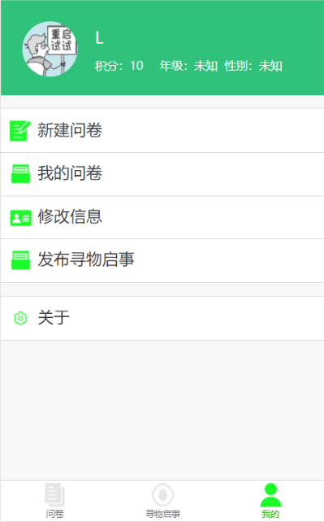
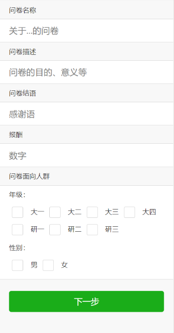
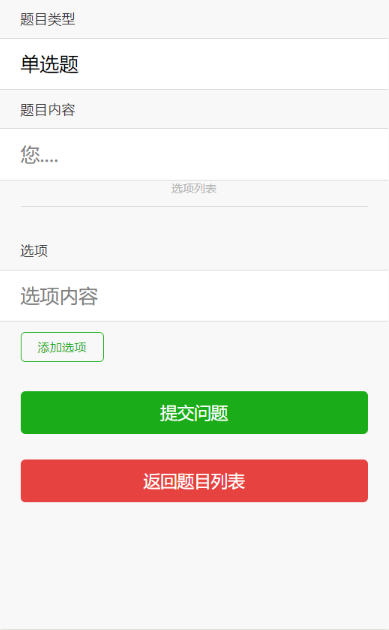
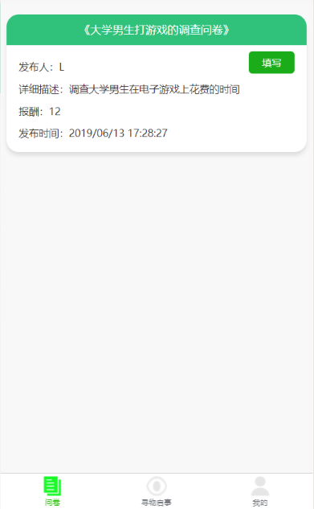
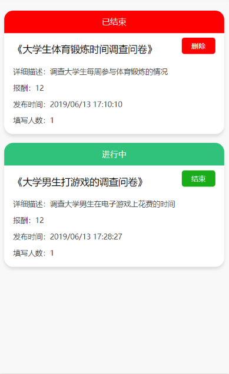
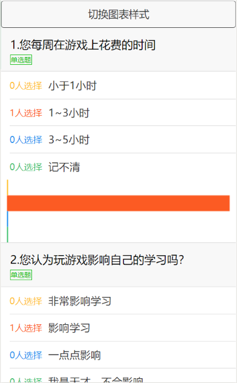
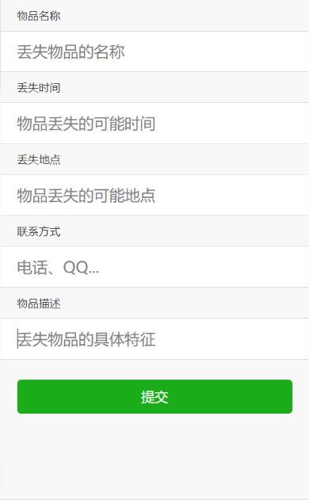
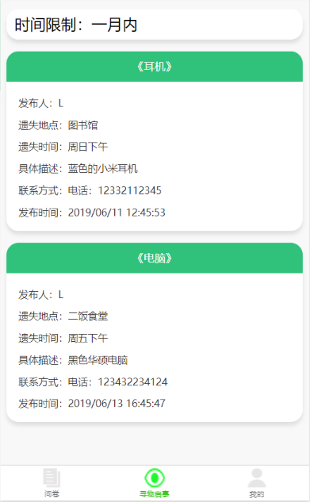
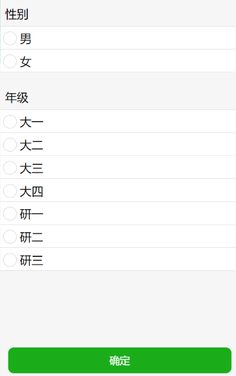
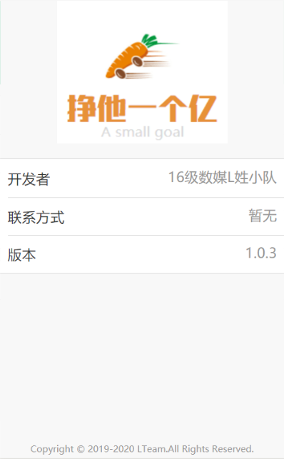

# 界面设计

| 版本 | 日期 | 描述 | 作者 |
| - | - | - | - |
| v1.8 | 2019.6.10 | 界面设计 | LYM |

* [登录](#登录)

* [我的](#我的)

* [新建问卷](#新建问卷)

* [问卷](#问卷)

* [填写问卷](#填写问卷)

* [我的问卷](#我的问卷)

* [问卷统计](#问卷统计)

* [发布寻物启事](#发布寻物启事)

* [寻物启事](#寻物启事)

* [修改信息](#修改信息)

* [关于](#关于)

## 登录

logo来源：[logofree.cn](http://www.logofree.cn/)
## 我的

图标来源：[阿里图标库](https://www.iconfont.cn/)

## 新建问卷

## 问卷

## 填写问卷

## 我的问卷

## 问卷统计

## 发布寻物启事

## 寻物启事

## 修改信息

## 关于

logo来源：[logofree.cn](http://www.logofree.cn/)
