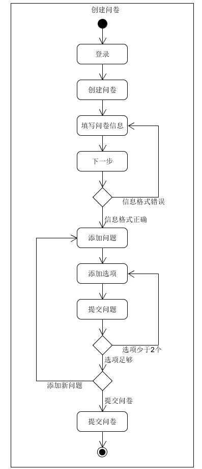
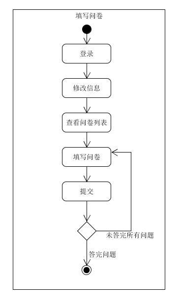
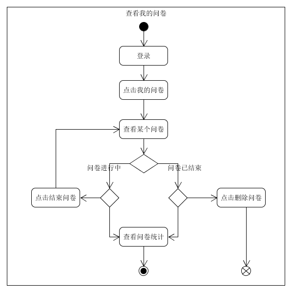
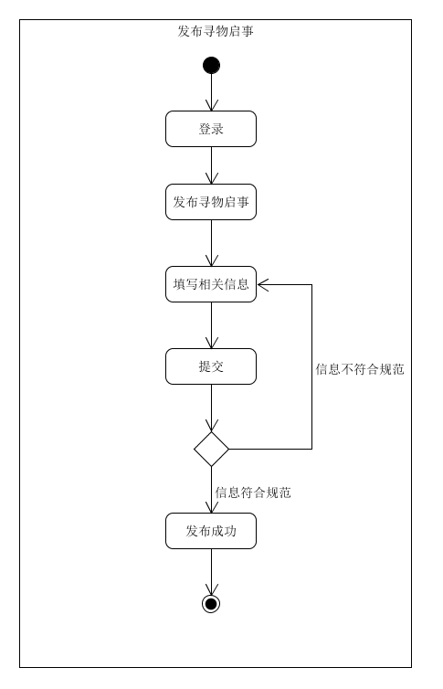

# 用例描述  

| 版本 | 日期 | 描述 | 作者 |  
| - | - | - | - |  
| v1.2 | 2019.4.29 | 用例描述 | LYS |  

## 业务活动图
* 创建问卷

* 填写问卷

* 查看我的问卷

* 发布寻物启事

## 用例描述
* 创建问卷

用户登录后，在“我的”页面中点击“创建问卷”，进入创建问卷页面，填写问卷基本信息后，点击下一步。此时对用户输入的问卷基本信息进行检测，如果某项信息为空或报酬不为正整数，则显示错误信息，反之则成功进入下一步。在下一步中，用户点击“添加问题”按钮来添加新问题，填写问题信息后添加选项，然后提交问题。若选项少于2个，则显示错误信息，反之则成功提交问题。提交问题成功后，用户可以添加新问题，也可以提交问卷，只有当问题数大于等于1时，才能成功提交问卷。

* 填写问卷

用户登录后，首次登录时需要修改个人信息，问卷列表根据用户的性别和年级渲染出符合条件的问卷。用户点击某个问卷的“填写”按钮，进入该问卷的填写页面。用户完成问卷后，点击“提交”按钮，系统检测用户是否答完问题。若是，则成功提交，否则显示错误信息，用户继续填写问卷。

* 查看我的问卷

用户登录后，在“我的”页面中点击“我的问卷”，查看自己发布的问卷。问卷有进行中或是已结束两种状态，对于进行中的问卷，用户可以点击“结束”按钮，结束问卷调查；对于已结束的问卷，用户可以点击“删除”按钮，删除该问卷。用户也可以点击任意问卷，进入该问卷的统计页面。

* 发布寻物启事

用户登录后，在“我的”页面点击“发布寻物启事”，填写寻物启事的基本信息后，点击“提交”按钮。若输入的信息不为空，则发布成功；反之则显示错误信息，用户继续填写寻物启事的基本信息。
