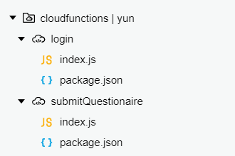
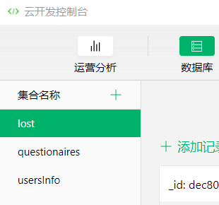

# Deployment

| 版本 | 日期 | 描述 | 作者 |
| - | - | - | - |
| v1.1 | 2019.6.22 | 部署报告 | LYM |

“先挣他一个亿”是一个微信小程序，我们已将其发布，打开微信，扫描下方二维码或搜索“先挣他一个亿”，即可使用小程序。

## 部署说明
1、前往微信公众平台，下载[微信开发者工具](https://developers.weixin.qq.com/miniprogram/dev/devtools/devtools.html)

2、下载[本项目源码](https://github.com/wicrohard/Project)

3、在微信开发者工具中导入本项目

4、将项目中的这两个云函数上传到云平台

5、点击云开发，进入云开发控制台，在数据库中添加集合lost、questionaires和usersInfo

6、编译运行，首次登录后，请先修改个人信息。
