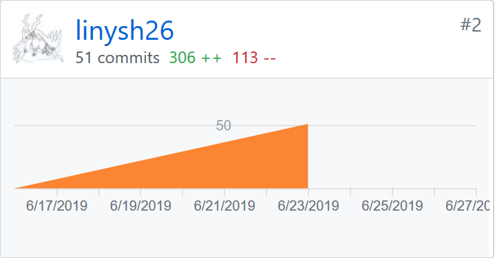

## 个人小结
   这是一次非常珍贵的团队协作经历，以及一个产品如何从产品设计到代码实现的完整过程的体验，如何进行迭代开发等工作的经验，受益匪浅

## PSP2.1统计表
                            
| PSP阶段 | 耗时(h) |
| --------- | - |
| 计划 | 4 |
| ·估计任务时间 | 4 |
| 开发 | 55 |
| ·分析需求 | 5 |
| ·生成设计文档 | 5 |
| ·设计复审 | 5 |
| ·代码规范 | 5 |
| ·具体设计 | 5 |
| ·具体编码 | 15 |
| ·代码复审 | 5 |
| ·测试 | 20 |
| 报告 | 11 |
| ·测试报告 | 5 |
| ·计算工作量 | 2 |
| .事后总结，提出过程改进计划 | 4 |
| 合计 | 80 |

## 主要工作清单  
前端开发：微信小程序前端数据库操作，云函数编写，页面编写（lostList, mine, newLost）  

文档编辑：用例+活动图、代码规范、领域模型、状态模型、数据库设计第三次迭代会议记录

## 个人GIT总结  

* 代码仓库贡献

   

* 文档仓库贡献

     
  
 
## 个人博客清单  

+ [微信小程序云开发：数据库操作](https://blog.csdn.net/Lyn_B/article/details/93533339)  
+ [微信小程序云开发：项目创建与云开发控制台](https://blog.csdn.net/Lyn_B/article/details/93480900)  

## 特别致谢  
感谢每个人一直以来的努力
