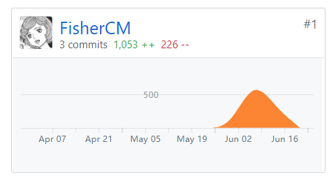
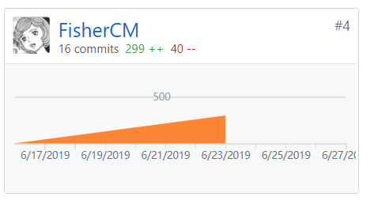

## 个人小结
   这个项目可以说是大学中第一个从头到尾完整参与开发的项目，从项目规划到需求分析，再到设计阶段，开发阶段，后期测试，这个开发经历让我完整地体验了一个小型项目从无到有的整个过程，熟悉了各个开发环节，同时也学习到了一定的项目管理经验，可以说是一次十分宝贵的经历。
   
   我在团队中担任客户经理和测试工程师，作为客户经理，我在分析了项目前景和客户需求之后，拟定了项目的开发目标，给出了项目的API设计和架构设计，并参与到整个开发过程中，根据开发情况和与组员的讨论适当地对项目目标进行修改；作为测试工程师，我参与完成了项目后期的测试工作。

## PSP2.1统计表

| PSP阶段 | 耗时(h) |
| --------- | - |
| 计划 | 10 |
| ·估计任务时间 | 10 |
| 开发 | 60 |
| ·分析需求 | 5 |
| ·生成设计文档 | 10 |
| ·设计复审 | 5 |
| ·代码规范 | 0 |
| ·具体设计 | 8 |
| ·具体编码 | 20 |
| ·代码复审 | 2 |
| ·测试 | 10 |
| 报告 | 8 |
| ·测试报告 | 5 |
| ·计算工作量 | 0 |
| .事后总结，提出过程改进计划 | 3 |
| 合计 | 78 |

## 主要工作清单

项目前期调研与项目愿景规划，项目具体设计，后期测试工作

前端开发：登陆云函数，回答问卷页面，用户个人问卷页面

文档编辑：前期调研与愿景文档，API设计文档，架构设计文档，补充需求分析，第二次迭代会议记录

## 个人GIT总结
* 代码仓库贡献

   

* 文档仓库贡献

   

## 特别致谢
感谢团队各位小伙伴的协作。
