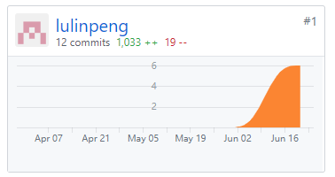
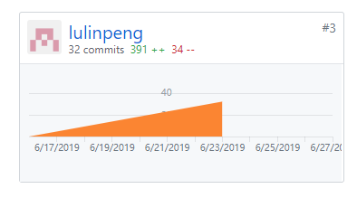

## 个人小结

   这个项目是我第一次接触微信小程序开发，并且尝试发布了我们小组完成的小程序。总的来说，学到了很多东西。从对微信小程序的一无所知，到整个微信小程序的完工，我学习到了许多东西，报错微信小程序云开发、JavaScript、以及项目管理等知识。这次项目是我真正意义上的完成一个能够供他人使用的项目。
   
   在这次项目中，我和小组成员们以通完成了一个项目凑够需求分析到上线的整个过程，总来说还是挺有成就感的。

## PSP2.1统计表

| PSP阶段 | 耗时(h) |
| --------- | - |
| 计划 | 4 |
| ·估计任务时间 | 4 |
| 开发 | 65 |
| ·分析需求 | 3 |
| ·生成设计文档 | 4 |
| ·设计复审 | 4 |
| ·代码规范 | 0 |
| ·具体设计 | 5 |
| ·具体编码 | 40 |
| ·代码复审 | 5 |
| ·测试 | 4 |
| 报告 | 6 |
| ·测试报告 | 0 |
| ·计算工作量 | 3 |
| .事后总结，提出过程改进计划 | 3 |
| 合计 | 75 |

## 主要工作清单

前端开发：新建问卷界面，登录界面，可填写问卷列表界面，提交问卷的云函数

文档编辑：项目启动会议记录，第四次迭代会议记录、REST API设计规范，架构设计、详细设计（BCE方法）到应用程序框架映射指南，功能模型，关于文档，团队介绍文件
## 个人GIT总结
* 代码仓库贡献

* 文档仓库贡献

## 个人博客清单
- [16340159-微信小程序：获取用户openid](https://blog.csdn.net/llp0159/article/details/93801930)

## 特别致谢
感谢团队各位小伙伴的协作。
