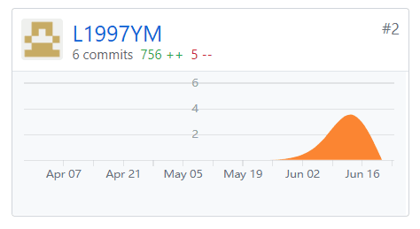
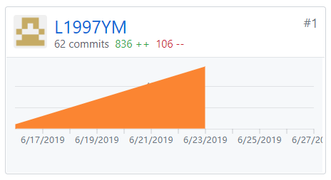

## 个人小结
   这可能是大学三年来，自己投入时间和精力最多的一个项目，也是自己第一次参与微信小程序的开发。总体来说，学习到了很多，温习了前端开发的方式，熟悉了微信小程序云开发的模式，更重要的是，了解了一个软件产品由无到有的整个流程，这是原先从而完整接触过的。
   
   我在团队中担任产品经理和JS工程师，作为产品经理，我和团队成员一同完成了项目的定义、规划和设计，保证了项目的按时完成，并先后发布了三个微信小程序的线上版本；作为JS工程师，我参与完成了部分前端开发、画图和文档编辑。

## PSP2.1统计表

| PSP阶段 | 耗时(h) |
| --------- | - |
| 计划 | 4 |
| ·估计任务时间 | 4 |
| 开发 | 66 |
| ·分析需求 | 2 |
| ·生成设计文档 | 3 |
| ·设计复审 | 4 |
| ·代码规范 | 0 |
| ·具体设计 | 5 |
| ·具体编码 | 43 |
| ·代码复审 | 5 |
| ·测试 | 4 |
| 报告 | 6 |
| ·测试报告 | 0 |
| ·计算工作量 | 2 |
| .事后总结，提出过程改进计划 | 4 |
| 合计 | 76 |

## 主要工作清单

前端开发：问卷统计页面、关于页面、修改信息页面

文档编辑：产品特性、用例图、用例设计、代码规范、部署报告、第一次迭代会议记录、第五次迭代会议记录

## 个人GIT总结
* 代码仓库贡献

* 文档仓库贡献

## 个人博客清单
- [16340163-微信小程序前端：绘制条形图](https://blog.csdn.net/qq_36335657/article/details/93655796)

## 特别致谢
感谢团队各位小伙伴的协作。
