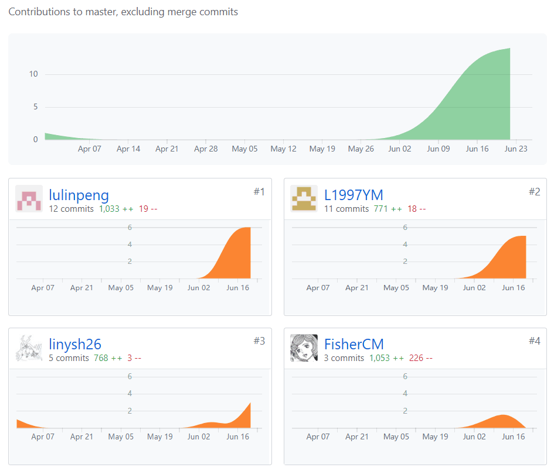
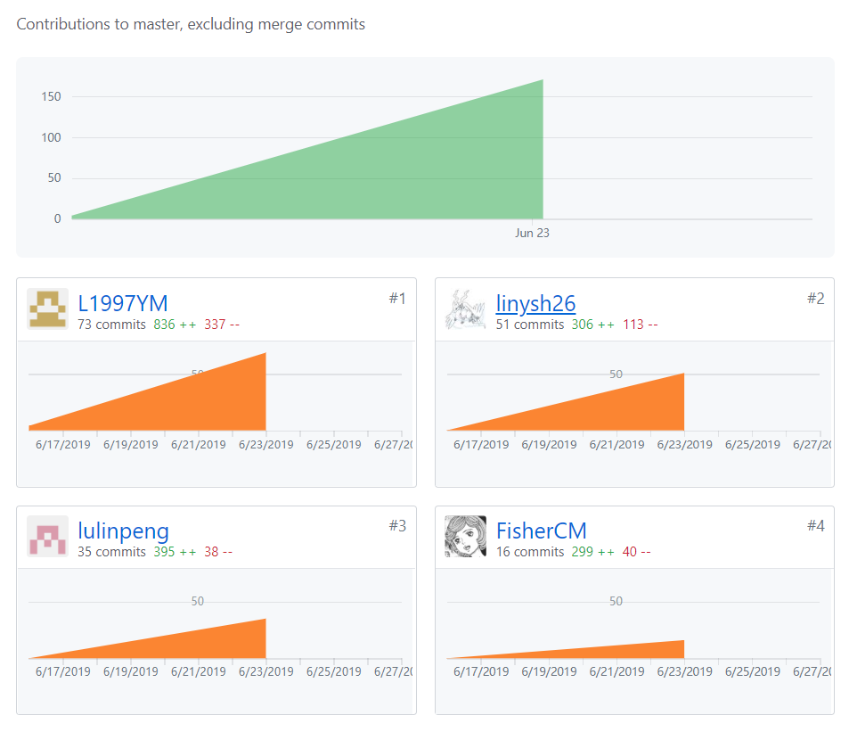

# 小组分工与贡献率说明

## 个人小结
   
   
   
- [16340163-LYM](16340163-LYM.md)
- [16340159-LLP](16340159-LLP.md)
- [16340144-LYS](16340144-LYSH.md)
- [16340151-LJY](16340151-LJY.md)

## PSP2.1汇总表
   
   
   
   
| PSP阶段 | LYM | LYS | LLP | LJY |
| --------- | - | - | - | - |
| 计划 | 4 | 4 | 4 | 10 |
| ·估计任务时间 | 4 | 4 | 4 | 10 |
| 开发 | 66 | 55 | 65 | 60 |
| ·分析需求 | 2 | 5 | 3 | 5 |
| ·生成设计文档 | 3 | 5 | 4 | 10 |
| ·设计复审 | 4 | 5| 4 | 5 |
| ·代码规范 | 0 | 5 | 0 | 0 |
| ·具体设计 | 5 | 5 | 5 | 8 |
| ·具体编码 | 43 | 15 | 40 | 20 |
| ·代码复审 | 5 | 5 | 5 | 2 |
| ·测试 | 4 | 20 | 4 | 10 |
| 报告 | 6 | 11 | 6 | 8 |
| ·测试报告 | 0 | 5 | 0 | 5 |
| ·计算工作量 | 2 | 2 | 3 | 0 |
| .事后总结，提出过程改进计划 | 4 | 4 | 3 | 3 |
| 合计 | 76 | 80| 75 | 78 |
   
   
   

## 项目仓库贡献

* 代码仓库

* 文档仓库

## 小组分工与贡献率

| 学号 | 姓名 | 分工 | 贡献率（合计100%） |
| -- | --- | ---------- | -- |
| 16340159 | 卢林鹏 | 开发：新建问卷界面，登录界面，可填写问卷列表界面，提交问卷的云函数 文档：项目启动会议记录，第四次迭代会议记录、REST API设计规范，架构设计、详细设计（BCE方法）到应用程序框架映射指南，功能模型，关于文档，团队介绍文件 | 25% |
| 16340163 | 罗源茂 | 开发：问卷统计页面、关于页面、修改信息页面 文档：产品特性、用例图、用例设计、代码规范、部署报告、第一次迭代会议记录、第五次迭代会议记录 | 25% |
| 16340151 | 刘峻佚 | 开发：登陆云函数，回答问卷页面，用户个人问卷页面 文档：前期调研与愿景文档，API设计文档，架构设计文档，补充需求分析，第二次迭代会议记录 | 25% |
| 16340144 | 林一山 | 开发：微信小程序前端数据库操作，云函数编写，页面编写（lostList, mine, newLost） 文档：用例+活动图、代码规范、领域模型、状态模型、数据库设计第三次迭代会议记录 | 25% |

## 制品与贡献率

| | 制品 | 卢林鹏 | 罗源茂 | 刘峻佚 | 林一山 |
| - | - | - | - | - | - |
| 源代码 | 前端代码 | 30% | 30% | 20% | 20% |
| 测试 | | 15% | 15% | 35% | 35% |
| 文档 | 项目概况 | 100% | - | - | - |
| | 团队组建 | 100% | - | - | - |
| | 项目前期调研 | - | - | 100% | - |
| | 项目愿景 | - | - | 100% | - |
| | 产品特性 | - | 100% | - | - |
| | 需求规格说明书 | 17% | 16% | 17% | 50% |
| | 设计说明书 | - | 40% | 40% | 20% |
| | 生产规范与指南 | 50% | 25% | - | 25% | 
| | 会议记录 | 33% | 33% | 17% | 17% |
| 综合贡献 | | 25% | 25% | 25% | 25% |
   
